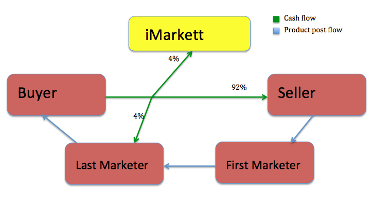

# iMarkett
This is to help online sellers sell things faster using an affiliate marketing system applied on the e-commerce platform.

The point of this is to combine social networking and e-commerce. They have been separate entities for a while with social networks fueling sales. The only close examples of social e-commerce are platforms like the Facebook Marketplace, Depop & Instagram. These platforms allow for marketing and sales to take place. 

What differentiates iMarkett from these other platforms is this affiliate marketing system that works by hitting a share button on the platform.

Think of merging eBay and Facebook. It works like the following model.

There is buyer and seller like the traditional e-commerce business model but now we have added another party to take part of the transaction. This other party is called a "Marketer" one is a Marketer by sharing product posts. If a Seller places a product posts and a Marketer likes the product they can share it like they would share a Facebook post or like a Retweet. If someone from the Marketer's network buys the product the Marketer will get 4% of the transaction. If someone from that Marketer's network wants to share it, they can. Then it can follow that similar pattern. The Marketer that connects the Buyer and the Seller will get 4% of the sale and the Seller will get 92% of the sale which is a bigger profit margin for the seller. The greatest thing of all is that a user can be a Marketer, Buyer & a Seller. So this platform is for people that like to buy things and that want to make money. We aim to make this Marketer process as simple as retweeting a tweet. If you want to be a part of this project it is highly appreciated and please email me!

<a href="mailto:claudio@imarkett.com?subject=iMarkett-Help">E-mail</a>